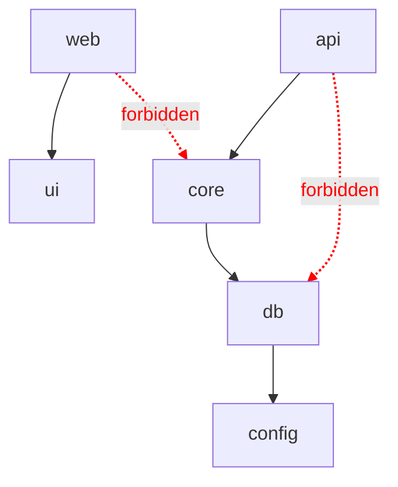

# Dependency Flow ESLint Rule

`dependency-flow` is a custom ESLint rule in `@forgekit/eslint-plugin` that fails the build on a forbidden cross-package import.

## Why

ForgeKit uses a layered monorepo architecture where each package may depend only on the next layer down: `web` on `ui`, and `api` on `core` on `db` on `config`.

This keeps the dependency graph acyclic, concerns separated, and packages independently reasonable and extractable. Without enforcement, it is easy to accidentally add a forbidden edge, such as an app reaching past its layer or `ui` reaching into `db`. Those edges create hidden coupling and erode the architecture.

Enforcing the boundary as a build-failing lint rule makes it a hard constraint caught in the pull request, not a convention people forget.

## The allowed dependency graph



The runtime graph uses strict single-hop adjacency:

- `web` -> `ui`
- `ui` -> `(none)`
- `api` -> `core`
- `core` -> `db`
- `db` -> `config`
- `config` -> `(none)`

Reaching past the next layer is forbidden. The shared tooling config packages, `eslint-config`, `typescript-config`, `vitest-config`, and `eslint-plugin`, are exempt because they are dev infrastructure, not runtime flow.

## How it works

The rule is published from `@forgekit/eslint-plugin` under the rule name `dependency-flow`.

For each linted file, it determines the owning package from the file's `packages/<name>` or `apps/<name>` path. For every `@forgekit` import or re-export, it extracts the target package and checks it against the owning package's allowed set.

Tooling packages and imports outside the `@forgekit` scope are ignored. A forbidden governed import is reported.

## When it fires

For example, this import from `apps/api` is forbidden:

```ts
import { createConnection } from "@forgekit/db";
```

The rule reports:

```text
@forgekit/api may not import @forgekit/db. Allowed internal dependencies: @forgekit/core.
```

## Fixing a violation

Route the dependency through the allowed layer. For example, if `api` needs behavior backed by `db`, expose that behavior from `core` and import it from `@forgekit/core`.

If the architecture genuinely needs to change, change the adjacency map deliberately and keep the docs aligned with that decision.

## How it is wired

The rule is enabled as an error in the shared flat ESLint config, so `pnpm lint` enforces it across every package and app.

## Adding more rules

The plugin is structured to hold more rules. Add a rule under the plugin's rules map and document it in `docs/eslint-rules/`.
