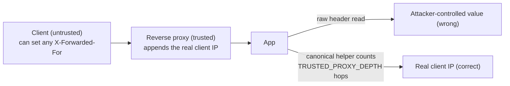

# No Raw Client IP Header ESLint Rule

`no-raw-client-ip-header` is a custom ESLint rule in `@forgekit/eslint-plugin` that fails the build on raw reads of forgeable client-IP headers.

## Why

Client-IP headers are set by the client and are trivially forged. Only a helper that counts trusted proxy hops with `TRUSTED_PROXY_DEPTH` can find the real IP. Reading the raw header trusts an attacker-controlled value, which breaks rate limiting, audit trails, and IP allowlists.



The proxy can append trustworthy hop data, but the app must use the canonical helper to count from the trusted side of the chain.

## How it detects

The rule flags blocked header names wherever they appear as a plain string or a zero-expression template literal, case-insensitive, so it does not depend on a framework's header API.

Blocked headers:

- `x-forwarded-for`
- `x-real-ip`
- `cf-connecting-ip`
- `true-client-ip`
- `x-client-ip`

## Where it applies

The rule applies to serving code under `packages/` and `apps/`. It does not apply to `tooling/` or test files, including `__tests__`, `*.test.ts`, and `*.spec.ts`.

The scope is repo-wide across serving code because the subject is a location-independent string, unlike the package-local rules. Tests and tooling never serve attacker traffic.

## Fixing a violation

Read the client IP through the canonical client-IP helper.

Use a disable comment with a reason for the one legitimate helper read and for deliberate non-read uses, such as setting, stripping, or redacting the header:

```ts
// eslint-disable-next-line @forgekit/no-raw-client-ip-header -- canonical helper
const header = request.headers.get("x-forwarded-for");
```

The canonical helper arrives in a later phase, so until then the disable is the sanctioned interim path for the single legitimate read.

## Known gaps

Computed construction like `"x-forwarded" + "-for"`, a name read from config, and header iteration such as `Object.entries(req.headers)` are not caught. A constant is caught at its declaration site.

The RFC 7239 `Forwarded` header is intentionally not matched to avoid false alarms and is the helper's responsibility.

This rule is a guardrail that stops mistakes, not a sandbox against a determined insider. Evasion is a code-review concern.
