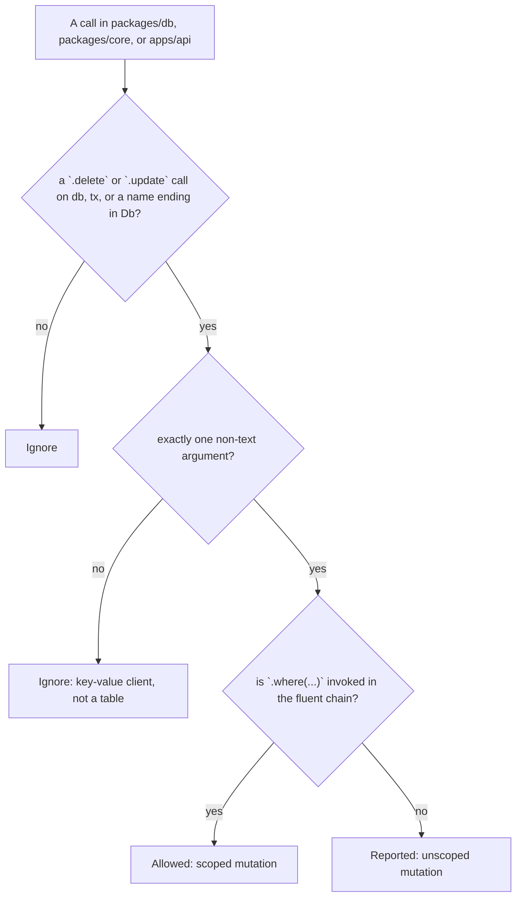

# No Unscoped DB Mutation ESLint Rule

`no-unscoped-db-mutation` is a custom ESLint rule in `@forgekit/eslint-plugin` that reports recognized Drizzle delete and update mutations missing a `.where(...)` filter.

## Why

In Drizzle, `db.delete(table)` deletes every row in the table unless the delete builder is narrowed with `.where(...)`. Likewise, `db.update(table).set(values)` overwrites every row unless the update builder is narrowed with `.where(...)`.

This rule is a syntax-level nudge against accidental missing-`.where()` mutations. [Row-Level Security](https://www.postgresql.org/docs/current/ddl-rowsecurity.html) is the real guard against cross-org writes.

A missed scope can erase or overwrite shared state. The rule makes scoped mutations a build-enforced habit instead of a convention, while staying honest that syntax alone cannot prove the predicate is meaningful.

## How it works

The rule is published from `@forgekit/eslint-plugin` under the rule name `no-unscoped-db-mutation`.

For each linted file in the Drizzle surface, it looks for a non-computed `.delete(...)` or `.update(...)` call where the receiver is named `db`, named `tx`, or ends with `Db` or `DB`. It then requires exactly one argument, and ignores string, number, and template literal arguments so key-value clients such as `db.delete("store", key)` do not get reported.

A mutation is treated as scoped only when an invoked `.where(...)` appears in the fluent chain built on top of the mutation call. For deletes, that is usually right after `delete(table)`:

```ts
db.delete(users).where(eq(users.orgId, orgId));
```

For updates, the `where(...)` call usually appears after `set(...)`:

```ts
db.update(users).set({ active: false }).where(eq(users.orgId, orgId));
```

Further chaining after the `where(...)` call is allowed:

```ts
await db.update(users).set({ active: false }).where(eq(users.orgId, orgId)).returning();
```

The decision in one picture:



## Where it applies

The rule runs only inside `packages/db`, `packages/core`, and `apps/api` server code that may hold a Drizzle handle. It does not run in `apps/web`, `tooling`, or tests.

That scope is a false-positive-avoidance choice, not a guarantee that every unscoped mutation is caught. The `dependency-flow` rule stops other runtime packages from importing `@forgekit/db` directly, so a `db`-named handle in browser or tooling code is usually unrelated. `packages/core` can still re-export the handle across the allowed `api -> core` edge, and the handle can be aliased.

## When it fires

These mutations from `packages/db`, `packages/core`, or `apps/api` server code are forbidden:

```ts
await db.delete(users);
await db.update(users).set({ active: false });
```

The rule reports that the mutation has no `.where(...)` scope and should be narrowed to the caller's rows.

## Fixing a violation

Scope the mutation to the caller or tenant boundary:

```ts
await db.delete(users).where(eq(users.orgId, orgId));
await db.update(users).set({ active: false }).where(eq(users.orgId, orgId));
```

If mutating every row is truly intended, put that operation behind an explicit lint disable with a reason:

```ts
// eslint-disable-next-line @forgekit/no-unscoped-db-mutation -- required test cleanup for a disposable database
await db.delete(users);
```

A legitimate all-row mutation belongs behind that explicit comment so reviewers can see the intent at the call site. This is a guardrail, not a sandbox.

## Known gaps

This rule reads the shape of the code, not its types or runtime values. That keeps it fast and simple, and it is honest about the cases that shape alone cannot catch. Each gap below is a direct consequence.

### Always-true filter (passes, but is unsafe)

```ts
db.delete(users).where(sql`1=1`);
db.update(users).set({ active: false }).where(sql`1=1`);
```

This passes because the rule checks that a `.where()` exists, not that the predicate is meaningful.

### Aliased handle (passes, but is unsafe)

```ts
const d = db;

d.delete(users);
d.update(users).set({ active: false });
```

This passes because the receiver name (`d`) is not `db`, `tx`, or a name ending in `Db` or `DB`.

### Split or `$dynamic()` builder (reported even though it is fine)

The rule checks whether `.where(...)` is invoked in the same fluent chain as the mutation. If you build the query across statements, it cannot see the connection and reports the mutation:

```ts
const deleteQuery = db.delete(users);                 // reported: no .where() in this chain
deleteQuery.where(eq(users.orgId, orgId));            // the filter is added here, on a later line

const updateQuery = db.update(users).set({ active: false }); // reported: no .where() in this chain
updateQuery.where(eq(users.orgId, orgId));                   // the filter is added here, on a later line
```

Following a variable to a later `.where()` needs data-flow analysis and is unreliable anyway, because that later `.where()` might be conditional. For a deliberate split, use the disable comment with a reason.

### Computed access `db["delete"](users)` (ignored)

The rule matches the dot form (`db.delete(...)` and `db.update(...)`), not bracket access:

```ts
db["delete"](users);                        // not caught
db["update"](users).set({ active: false }); // not caught
```

Bracket access is an unusual way to call these methods, and anyone writing it is almost certainly evading the rule on purpose, which the disable comment already allows.

### Raw SQL deletes and updates (ignored)

The rule understands the query builder, not raw SQL. A raw `DELETE` or `UPDATE` is just a template string to it:

```ts
db.execute(sql`DELETE FROM users`);                    // no WHERE, but not caught
db.execute(sql`UPDATE users SET active = false`);      // no WHERE, but not caught
```

Parsing SQL inside a string is a separate, much larger job, and raw SQL is rare in this kit.

### `.where(undefined)` (passes, but is unsafe)

Syntactically there is a `.where(...)`, so the rule trusts it. If the condition is `undefined` at runtime, Drizzle applies no filter and mutates every row:

```ts
db.delete(users).where(condition);                                // passes even if condition is undefined at runtime
db.update(users).set({ active: false }).where(condition);         // passes even if condition is undefined at runtime
```

The rule never runs the code, so it cannot know the value passed in is empty.

## Why a syntax rule, and the stronger option

The rule is syntax-based: it matches the shape of the code (a `.delete` or `.update` call on a `db`-like name, one non-text argument, no `.where()` in the fluent chain) and never asks the TypeScript compiler what anything actually is. That is why it leans on the receiver being named `db`, `tx`, or ending in `Db`.

A stronger, type-aware version could ask the compiler whether the type of the receiver comes from `drizzle-orm`, which would identify a real Drizzle handle no matter what it is named and never flag a lookalike. We do not do that yet because type-aware linting makes every run type-check the whole project (slower) and needs more test setup, and there are no delete or update sites in the codebase to get wrong. If a real miss ever appears, that is the signal to make the switch. A type-aware check would only settle the "is this really a Drizzle handle" question; it would not close the split-builder, raw-SQL, or `.where(undefined)` gaps above, which are beyond static analysis.

## References

- [Drizzle ORM: Delete](https://orm.drizzle.team/docs/delete) and [Update](https://orm.drizzle.team/docs/update) - the `.delete()`, `.update()`, and `.where()` builders this rule inspects.
- [Postgres: Row Security Policies](https://www.postgresql.org/docs/current/ddl-rowsecurity.html) - the real cross-org write guard this rule only nudges toward.
- [ESLint: Custom Rules](https://eslint.org/docs/latest/extend/custom-rules) - how a rule like this is written.
